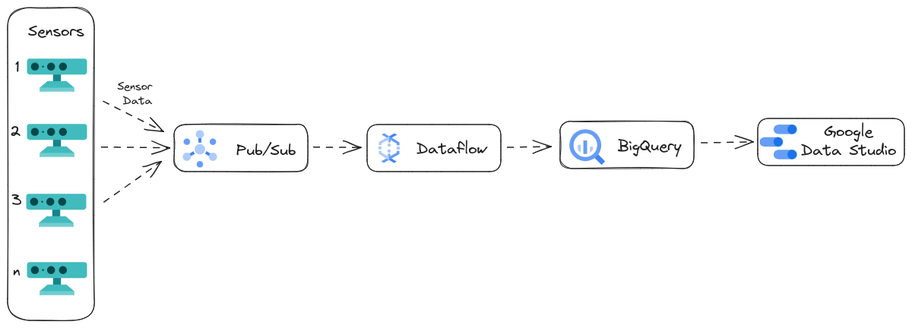

# Real-Time IoT Data Pipeline

## Project Overview

This project demonstrates the creation of a real-time data pipeline on Google Cloud Platform (GCP) to process and analyze IoT device data. The pipeline ingests data from simulated IoT devices, processes it using Dataflow, and stores it in BigQuery and Cloud Storage for further analysis and visualization.

### Data Architecture


### Project Structure
```plaintext
streaming-iot-pipeline/
├── data/
│   └── sensor_obs.csv.gz
├── assets/
│   └── Sensor.png
├── main.py
├── process_main.py
├── sensor_simulation.py
├── requirements.txt
├── .env.example
├── .gitignore
└── README.md
```

## Project Structure

The project is structured into four main phases:

1. **IoT Device Simulation**: Simulate data from IoT devices using python and publish it to a Pub/Sub topic.
2. **Data Ingestion**: Ingest simulated data using Pub/Sub.
3. **Data Processing**: Process data in real-time using Dataflow to compute the average speed.
4. **Data Storage and Analysis**: Store data in BigQuery and Cloud Storage, and visualize it with Google Data Studio.

## IoT Device Simulation

### Description
Simulate IoT device data and publish it to a Pub/Sub topic for real-time ingestion.

### Tools
- **Python**: To script the simulation of IoT device data.
- **Google Cloud Pub/Sub**: To publish simulated data.

### Process
1. Create a Pub/Sub topic.
2. Run `main.py` python script to simulate IoT device data and publish it to the Pub/Sub topic.

## Data Ingestion

### Description
Ingest IoT data streams using Pub/Sub to buffer and forward data to Dataflow for processing.

### Tools
- **Google Cloud Pub/Sub**: For data ingestion and buffering.

## Data Processing

### Description
Use Dataflow to process and transform IoT data in real-time.

### Tools
- **Apache Beam**: For defining data processing pipelines.
- **Google Cloud Dataflow**: For running the Beam pipelines.

### Process
1. Develop an Apache Beam pipeline to process and transform the IoT data to compute the average speed.
2. Deploy the Beam pipeline on Dataflow for real-time processing.

## Data Storage and Analysis

### Description
Store processed data in BigQuery and Cloud Storage for analysis and visualization.

### Tools
- **Google BigQuery**: For structured data storage and analysis.
- **Google Cloud Storage**: For temporary and staging location for Dataflow process
- **Google Data Studio**: For data visualization.

### Process
1. Configure the Dataflow pipeline to store processed data in BigQuery and Cloud Storage.
2. Use Google Data Studio to create visualizations and dashboards for the processed data.

## Conclusion
This project demonstrates the end-to-end implementation of a real-time IoT data pipeline on GCP. It covers data ingestion, real-time processing, and storage, providing a foundation for analyzing and visualizing IoT data.